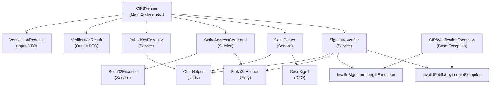

# cip8-verifier
A PHP library to verify Cardano CIP-8 signed messages.
 

```mermaid
graph TD
    A["CIP8Verifier<br/>(Main Orchestrator)"] --> B["VerificationRequest<br/>(Input DTO)"]
    A --> C["VerificationResult<br/>(Output DTO)"]
    
    A --> D["PublicKeyExtractor<br/>(Service)"]
    A --> E["StakeAddressGenerator<br/>(Service)"]
    A --> F["CoseParser<br/>(Service)"]
    A --> G["SignatureVerifier<br/>(Service)"]
    
    E --> H["Bech32Encoder<br/>(Service)"]
    
    D --> I["CborHelper<br/>(Utility)"]
    E --> J["Blake2bHasher<br/>(Utility)"]
    F --> I
    G --> I
    G --> J
    
    F --> K["CoseSign1<br/>(DTO)"]
    
    L["CIP8VerificationException<br/>(Base Exception)"] --> M["InvalidSignatureLengthException"]
    L --> N["InvalidPublicKeyLengthException"]
    
    G --> M
    G --> N
```
