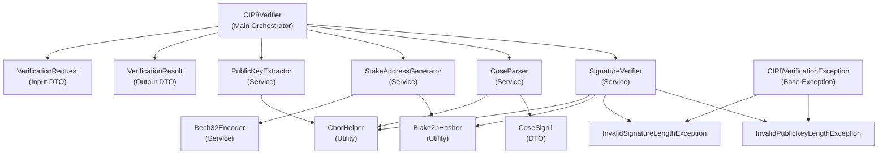

# CIP8 Verifier

[](https://php.net/)
[](LICENSE)

A robust, production-ready PHP library for verifying Cardano CIP-8 signed messages. This library provides a clean, type-safe API for validating cryptographic signatures from Cardano wallets.

## Features

- ✅ **Full CIP-8 Compliance** - Complete implementation of Cardano's CIP-8 message verification standard
- 🔒 **Cryptographically Secure** - Uses Ed25519 signature verification with proper validation
- 🏗️ **Clean Architecture** - Built following SOLID principles with dependency injection
- 🛡️ **Type Safe** - Full PHP 8.1+ type hints and readonly classes
- ⚡ **High Performance** - Optimized CBOR parsing and efficient algorithms
- 🧪 **Thoroughly Tested** - Comprehensive test suite ensuring reliability
- 📖 **Well Documented** - Clear API documentation and usage examples

## Requirements

- PHP 8.1 or higher
- `ext-sodium` extension (for cryptographic operations)
- `spomky-labs/cbor-php` package (for CBOR encoding/decoding)

## Installation

Install via Composer:

```bash
composer require cardano-php/cip8-verifier
```

## Quick Start

_Please refer to the [frontend example](demo/frontend.html) code to see how to obtain the `signatureCbor`, `signatureKey`, `challengeHex`, `expectedSignerStakeAddress` and `networkMode` values._

```php
<?php

require 'vendor/autoload.php';

use CardanoPhp\CIP8Verifier\CIP8Verifier;
use CardanoPhp\CIP8Verifier\DTO\VerificationRequest;
use CardanoPhp\CIP8Verifier\Exception\CIP8VerificationException;

try {

    // Your verification data
    $request = new VerificationRequest(
        signatureCbor: "84582aa201276761646472657373581de07a9647d2048870a0726f78621863e03797dc17b946473a35ded45f75a166686173686564f4582431633364353630312d386563632d343264662d623162302d3061323934643061346564355840d40e65ebb258bd48d04092f485b845a6c0c9b1728e896c8364e51e1b6d67cd2c36dc17ad52409671a8ac8e2376e3bf138869621d03c28841a50cd68bc34fa108",
        signatureKey: "a4010103272006215820eb59d52fbd257d3f8f8f51dd59b2013092763fc9cbc109d32d837920be5e62be",
        challengeHex: "31633364353630312d386563632d343264662d623162302d306132393464306134656435",
        expectedSignerStakeAddress: "stake_test1upafv37jqjy8pgrjdauxyxrruqme0hqhh9ryww34mm297agc0f3vc",
        networkMode: 0
    );
    
    // Verify the signature
    $verifier = CIP8Verifier::create();
    $result = $verifier->verify($request);
    
    // Check results
    if ($result->isValid) {
        echo "✅ Signature is valid!\n";
    } else {
        echo "❌ Signature verification failed\n";
    }
    echo "Stake address matches: " . ($result->stakeAddressMatches ? 'Yes' : 'No') . "\n";
    echo "Challenge matches: " . ($result->challengeMatches ? 'Yes' : 'No') . "\n";
    echo "Signature validates: " . ($result->signatureValidates ? 'Yes' : 'No') . "\n";
    
} catch (CIP8VerificationException $e) {

    echo "❌ Verification error: " . $e->getMessage() . "\n";
    
} catch (Throwable $e) {

    echo "❌ Unexpected error: " . $e->getMessage() . "\n";
    
}
```

## API Reference

### Main Classes

#### `CIP8Verifier`

The main orchestrator class that coordinates all verification operations.

```php
// Create a new verifier instance
$verifier = CIP8Verifier::create();

// Verify with type-safe DTO
$result = $verifier->verify(VerificationRequest $request): VerificationResult
```

#### `VerificationRequest` (readonly DTO)

Input data structure for verification requests.

```php
new VerificationRequest(
    string $signatureCbor,                // CBOR-encoded signature data
    string $signatureKey,                 // Public key in CBOR format
    string $challengeHex,                 // Challenge message to verify
    string $expectedSignerStakeAddress,   // Expected stake address
    int $networkMode                      // Network mode (0=testnet, 1=mainnet)
)

// Factory method from an array
VerificationRequest::fromArray(array $data): VerificationRequest
```

#### `VerificationResult` (readonly DTO)

Output data structure containing verification results.

```php
readonly class VerificationResult {
    public bool $isValid;              // Overall validation result
    public bool $stakeAddressMatches;  // Stake address validation
    public bool $challengeMatches;     // Challenge content validation  
    public bool $signatureValidates;   // Cryptographic signature validation
}

// Convert to array
$result->toArray(): array

// Factory method
VerificationResult::createValid(bool $stakeAddressMatches, bool $challengeMatches, bool $signatureValidates): VerificationResult
```

### Exception Hierarchy

The library provides specific exceptions for different error scenarios:

```php
CardanoPhp\CIP8Verifier\Exception\CIP8VerificationException
├── InvalidSignatureLengthException
└── InvalidPublicKeyLengthException
```

### Service Classes

The library follows a modular architecture with focused service classes:

- **`PublicKeyExtractor`** - Extracts public keys from signature keys
- **`StakeAddressGenerator`** - Generates Cardano stake addresses
- **`Bech32Encoder`** - Handles bech32 address encoding
- **`CoseParser`** - Parses COSE_Sign1 message structures
- **`SignatureVerifier`** - Verifies Ed25519 signatures

## Usage Examples

### Error Handling

```php
use CardanoPhp\CIP8Verifier\CIP8Verifier;
use CardanoPhp\CIP8Verifier\DTO\VerificationRequest;
use CardanoPhp\CIP8Verifier\Exception\CIP8VerificationException;

try {
    $verifier = CIP8Verifier::create();
    $result = $verifier->verify($request);
    
    if (!$result->isValid) {
        // Handle validation failure (invalid signature, mismatched wallet, etc.)
        error_log("CIP8 verification failed");
    }
} catch (CIP8VerificationException $e) {
    // Handle specific CIP8 errors (invalid input format, parsing errors, etc.)
    error_log("CIP8 error: " . $e->getMessage());
} catch (Throwable $e) {
    // Handle unexpected errors
    error_log("Unexpected error: " . $e->getMessage());
}
```

### Dependency Injection

```php
use CardanoPhp\CIP8Verifier\CIP8Verifier;
use CardanoPhp\CIP8Verifier\Service\*;

// Manual dependency injection
$bech32Encoder = new Bech32Encoder();
$stakeAddressGenerator = new StakeAddressGenerator($bech32Encoder);
$publicKeyExtractor = new PublicKeyExtractor();
$coseParser = new CoseParser();
$signatureVerifier = new SignatureVerifier();

$verifier = new CIP8Verifier(
    $publicKeyExtractor,
    $stakeAddressGenerator,
    $coseParser,
    $signatureVerifier
);
```

## Architecture

The library follows clean architecture principles with clear separation of concerns:



## Network Modes

The library supports both Cardano networks:

- **Mainnet**: `networkMode = 1`
- **Testnet**: `networkMode = 0`

## Wallet Compatibility

This library supports signature verification from:

- ✅ **Lite Wallets** (Nami, Eternl, etc.) - Direct payload signing
- ✅ **Hardware Wallet** (Ledger) - Blake2b hashed payload signing

## Security Considerations

- All cryptographic operations use the `sodium` extension for security
- Signature validation follows Ed25519 standards
- Public key and signature length validation prevents malformed input attacks
- CBOR parsing is handled securely with proper error handling

## Performance

The library is optimized for performance:

- Efficient CBOR parsing and encoding
- Minimal memory allocations
- Fast cryptographic operations using native sodium functions
- Clean service architecture allows for easy optimization

## Contributing

Contributions are welcome! Please ensure your code follows:

- PSR-12 coding standards
- Comprehensive test coverage
- Proper type hints
- Clear documentation

## Testing

```bash
# Run the test suite
composer test

# Run with coverage
composer test:coverage

# Run static analysis
composer analyze
```

## Changelog

See [CHANGELOG.md](CHANGELOG.md) for version history and changes.

## License

This project is licensed under the MIT License - see the [LICENSE](LICENSE) file for details.

## Support

- 📖 **Documentation**: Check this README and inline code documentation
- 🐛 **Bug Reports**: Open an issue on GitHub
- 💡 **Feature Requests**: Open an issue with the `enhancement` label
- 💬 **Questions**: Start a discussion on GitHub Discussions

## Related Projects

- [Cardano CIP-8 Specification](https://cips.cardano.org/cips/cip8/)
- [CBOR PHP Library](https://github.com/Spomky-Labs/cbor-php)
- [PHP Sodium Documentation](https://www.php.net/manual/en/book.sodium.php)
